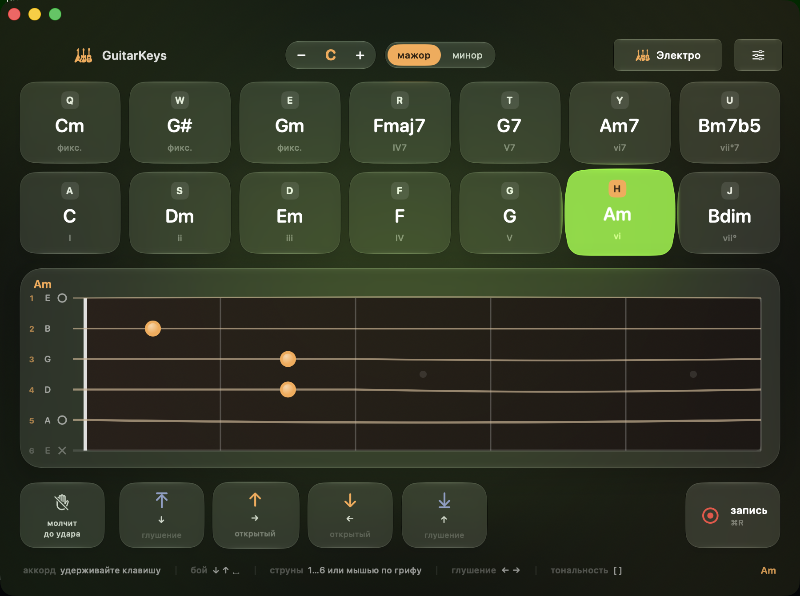

# GuitarKeys

Гитара на клавиатуре MacBook. Левая рука берёт аккорды буквенными клавишами, правая
бьёт стрелками. Звук считается в реальном времени физической моделью струны —
сэмплов в приложении нет.



Требуется macOS 26 или новее, Apple Silicon.

## Управление

| Клавиши | Действие |
|---|---|
| `A S D F G H J` | Трезвучия ступеней тональности (I ii iii IV V vi vii°) |
| `Q W E R T Y U` | Те же ступени септаккордами |
| `↓` или `␣` | Удар вниз |
| `↑` | Удар вверх |
| `1`…`6` | Отдельные струны: `1` — тонкая ми, `6` — басовая |
| Мышь по грифу | Дёрнуть струну; проводка через несколько — бой |
| `←` / `→` | Глушёный удар вниз / вверх |
| `⇧` с ударом | Глушение любого удара |
| `[` `]` | Тональность на полтона ниже / выше |
| `⌘R` | Начать или остановить запись |

Привязки идут по физическому положению клавиши, поэтому раскладка (в том числе
русская) на игру не влияет. Правый клик по любому пэду открывает настройку: другой
аккорд, другая ступень или другая клавиша.

Порядок аккордов меняется перетаскиванием. Клавиши закреплены за позициями —
переезжает содержимое, а не привязка.

### Звучит ли аккорд при нажатии

Переключатель слева от кнопок боя. Включён — клавиша сразу играет удар вниз. Выключен —
клавиша только зажимает аппликатуру молча, а ритм целиком за правой рукой. Если нужно,
чтобы аккорд звенел и после отпускания клавиши, снимите в настройках «Глушить струны
при отпускании».

## Инструменты

| | Характер |
|---|---|
| Классика | нейлон: мягкая атака, приглушённый верх, короткий сустейн |
| Акустика | сталь: звонкая атака, гулкая дека, длинный сустейн |
| Электро | звукосниматель: узкая полоса, долгий сустейн, ламповый перегруз |

Это не пресеты эквалайзера, а параметры модели: яркость, время затухания, положение
медиатора, гулкость корпуса. Любой можно подкрутить, «Вернуть заводской» откатывает.

## Живая рука

Ползунок в настройках задаёт, насколько игрок неровен. На нуле — работа секвенсора.
Чем выше, тем сильнее от удара к удару гуляют сила движения и каждой струны, скорость
проводки медиатора, попадание струн во времени, строй (до ±3 центов) и место щипка.
При ударе вверх медиатор порой не достаёт до басов.

Повторный удар по звучащей струне не обнуляет её: часть энергии остаётся и даёт
призвук настоящего медиатора.

## Запись

Кнопка справа на панели боя или `⌘R`. Пишется выход микшера, то есть ровно то, что
слышно, вместе с корпусом и реверберацией. Файлы — AAC в `~/Music/GuitarKeys/`.
После остановки появляется плашка с кнопками «Прослушать» и «Показать».

## iPhone и iPad

Отдельный экран под пальцы: аккорд удерживается касанием, бой берётся свайпом по
грифу или с крупных площадок внизу. Клавиш нет, зато есть тактильный отклик —
без него удар по стеклу не читается как взятие аккорда. Раскладка подстраивается:
на телефоне четыре аккорда в ряд, на планшете все семь.

Аудиодвижок и музыкальное ядро общие с маком, отличается только интерфейс.

## Сборка

macOS собирается без Xcode, достаточно Command Line Tools:

```
./build.sh              # собирает build/GuitarKeys.app
open build/GuitarKeys.app
```

Для iOS нужен Xcode (там лежит iPhone SDK):

```
./build-ios.sh          # для симулятора
./build-ios.sh device   # для устройства, потребует вашей подписи
```

Компилятор и SDK берутся из одного комплекта. Это важно: Command Line Tools и
Xcode обновляются вразнобой, и SDK, собранный более новым Swift, старый компилятор
читать откажется. `Tools/toolchain.sh` закрепляет за macOS связку из CLT, а
`build-ios.sh` — связку из Xcode.

Проверки:

```
./Tools/check.sh            # строй, огибающая, аппликатуры, привязки — без звука
./Tools/check.sh --audio    # плюс живой AVAudioEngine и запись в файл
./Tools/play.sh             # короткая пьеса вживую
```

Настройки хранятся в `~/Library/Application Support/GuitarKeys/preferences.json`.

## Как это устроено

```
Sources/GuitarKeys/
├── App.swift              точка входа, окно, меню
├── AppState.swift         тональность, зажатые аккорды, привязки, запись
├── Audio/
│   ├── GuitarSynth.swift  шесть струн, физическая модель, рендер
│   ├── GuitarModel.swift  классика / акустика / электро
│   ├── EventQueue.swift   очередь в аудиопоток без блокировок
│   └── AudioEngine.swift  граф AVAudioEngine, планировщик боя, запись
├── Music/
│   ├── Chord.swift        высоты, аккорды, лады, тональности
│   └── ChordLibrary.swift подбор аппликатуры
├── Input/                 коды клавиш, привязки, перехват клавиатуры
└── UI/                    экраны
```

### Синтез

Каждая струна — линия задержки, замкнутая через фильтр низких частот. Щипок заполняет
её отфильтрованным шумом, дальше сигнал бегает по петле, теряя высокие обертоны быстрее
низких. Позиция медиатора задаётся гребенчатым фильтром, глушение ладонью — укорочением
времени затухания.

Высоту тона задаёт не длина линии, а суммарная фазовая задержка петли: фильтр и
интерполятор дробной задержки тоже задерживают сигнал. Их вклад считается точно на
частоте ноты — иначе строй уезжает тем сильнее, чем выше нота. Отклонение на всём грифе
не больше 0.2 цента.

### Бой

Удары планируются с точностью до сэмпла: события кладутся в очередь без блокировок с
отметкой времени, а аудиопоток режет буфер ровно по этим отметкам. Струны вступают со
сдвигом 7–17 мс, при ударе вверх нижние звучат тише. Без этого шесть одновременных нот
звучали бы как рояль.

## Что проверено

`Tools/check.sh` прогоняет:

- строй шести открытых струн и ладов 1–12: отклонение меньше 0.2 цента (оценка высоты
  методом YIN)
- затухание, сустейн, глушение ладонью
- аккорд из шести струн: без клиппинга и NaN
- сэмплово-точное планирование удара
- все 120 аккордов (12 тоник × 10 видов): верные ступени, не выше 12 лада, растяжка не
  больше 3 ладов
- три инструмента строят, сустейн убывает от басов к верхам
- шестнадцатые в темпе 140 с перегрузом: без NaN и выхода за шкалу
- перестановка аккордов: клавиши на местах, ничего не теряется
- клавиши струн: под `1`…`6` лежат ноты E B G D A E
- попадание мышью по грифу, включая проводку через все шесть струн
- запись: файл читается обратно, длительность и уровень сигнала сходятся

## Технологии

Swift 6, SwiftUI, Observation, AppKit (перехват клавиатуры), AVFoundation
(`AVAudioEngine`, `AVAudioSourceNode`, `AVAudioUnitEQ`, `AVAudioUnitReverb`,
`AVAudioFile`), `Synchronization.Atomic` для очереди без блокировок, `Canvas` и
`TimelineView` для грифа, `MeshGradient` для фона, Liquid Glass (`glassEffect`,
`GlassEffectContainer`). Сборка — `swiftc` напрямую, без Xcode и SwiftPM.

## Автор

Vladislav Kovalskyi — [@vladislavkovalskyi](https://github.com/vladislavkovalskyi)
